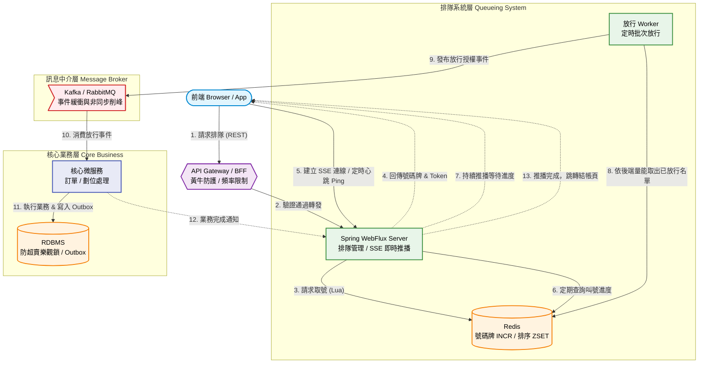
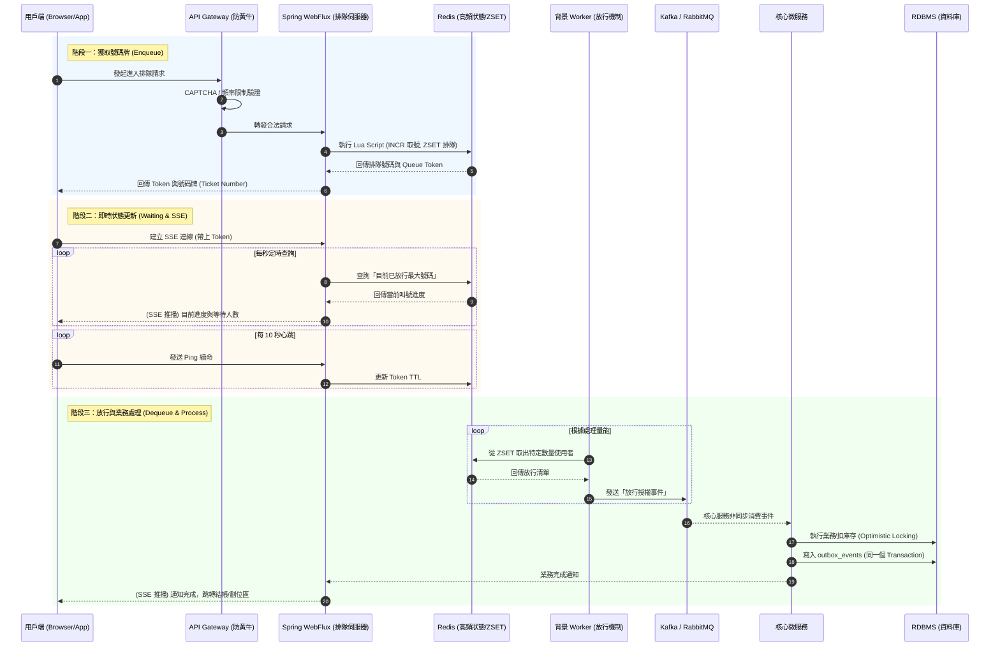

# 企業級排隊系統架構藍圖 (Enterprise Queueing System Blueprint)

實作一個高併發、高可用性的排隊系統（Queueing System），核心目標是**保護後端核心業務不被瞬間流量擊垮**，同時為前端使用者提供公平且透明的等待體驗。

## 系統架構圖



## 1. 核心技術選型與架構

一個強健的排隊系統必須將「高頻排隊狀態」與「核心業務處理」完全解耦：

* **Redis（高頻狀態管理與取號）：** 系統的心臟。利用 Redis 的 `INCR` 產生嚴格遞增的號碼牌，並以該號碼為 Score 存入 `ZSET` 實作絕對 FIFO 的排隊機制，扛住海量請求。
* **Kafka / RabbitMQ（非同步削峰）：** 負責將排隊放行後的請求封裝成事件（Event），確保後端微服務能以平穩的速率消化業務邏輯。
* **Spring WebFlux + SSE（即時狀態推播）：** 建立與前端的非阻塞長連線，主動推送排隊進度，並優雅處理高併發連線。
* **RDBMS（PostgreSQL / MySQL）：** 退居幕後，負責領域核心的 ACID 保證、防止超賣的最後實體防線，以及落實分散式交易的可靠性。

---

## 2. 系統運作標準流程與取號機制

導入類似實體銀行的「取號與叫號」機制，讓等待進度完全透明化。



### 階段一：獲取號碼牌 (Enqueue)

1. 使用者發起進入排隊的請求。
2. 系統透過 **Redis Lua Script** 執行原子性操作：
    * 檢查目前發放的總號碼是否已達活動上限。
    * 若未達上限，使用 Redis `INCR` 指令產生一個全域唯一的遞增序號（例如：第 1050 號）。
    * 將該序號作為 Score，使用者 ID 作為 Member，寫入 Redis `ZSET` 中。
3. 回傳專屬 Queue Token 與**「您的排隊號碼 (Ticket Number)」**給前端。

### 階段二：即時狀態更新 (Waiting & SSE Pushing)

1. 前端取得 Token 後，利用瀏覽器原生的 `EventSource` 建立 SSE (Server-Sent Events) 連線。
2. 後端利用定時任務，每秒從 Redis 查詢**「目前已放行的最大號碼（Current Serving Number）」**。
3. 透過 WebFlux 的 `Flux`，持續將「目前叫號進度」推播給客戶端。前端可直接以 `自己的號碼 - 目前叫號 = 前方等待人數`，呈現最精準的進度。

### 階段三：放行與業務處理 (Dequeue & Process)

1. **放行機制：** 後端 Worker 根據系統處理量能，從 Redis `ZSET` 依序取出特定數量（如 100 名）的使用者，更新「目前已放行最大號碼」，並將這些使用者移至「已放行」清單並設定過期時間。
2. **事件發布：** 觸發放行事件，將這批使用者的授權訊息送入 Kafka。
3. **核心業務執行：** 後端微服務從 Queue 拉取訊息執行資料庫寫入。
4. **完成通知：** 業務處理完畢後，透過 SSE 最終通知前端頁面跳轉至結帳或劃位區。

---

## 3. 連線狀態管理與斷線防護機制

必須將「使用者的排隊狀態」與「網路連線生命週期」完全解耦，以因應行動網路不穩或代理伺服器超時。

* **傳輸方案首選 SSE：** 由於排隊過程為伺服器單向廣播叫號進度，SSE 輕量、穿透性強，且瀏覽器原生支援自動斷線重連。
* **憑證認人 (Token-based Recovery)：** 前端斷線重連時只需帶上 Queue Token，後端即可確認其號碼牌並無縫恢復推播。
* **心跳與淘汰機制 (Heartbeat & TTL)：** Redis 為 Token 設定 TTL（如 30 秒）。前端需定時（如每 10 秒）發送 Ping 請求續命。超時未收到心跳即視為過號，清除殭屍佔位。
* **重連退避策略 (Exponential Backoff)：** 前端重連間隔應採指數級遞增並加入隨機延遲（Jitter），防止斷線客戶端瞬間同時重連引發伺服器雪崩。

---

## 4. RDBMS 在排隊系統中的核心定位

絕對不能將 RDBMS 放在高頻的「排隊狀態更新」路徑上，以免引發嚴重的 Row-Level Lock 競爭。RDBMS 的正確職責如下：

### 4.1 防止超賣的最終防線 (Optimistic Locking)

無論前端或 Redis 的限流做得多好，最終的資源扣減（如座位劃位與庫存扣減）都必須依賴資料庫。透過樂觀鎖確保並行寫入的安全：

```sql
UPDATE tickets 
SET stock = stock - 1, version = version + 1 
WHERE id = :ticketId AND version = :currentVersion AND stock > 0;
```

### 4.2 結合 Outbox Pattern 保證事件不遺失

當使用者通過排隊並完成核心業務後，通常需觸發後續流程（如開立票券、通知付款）。為了避免「資料庫寫入成功，但 Kafka 發送失敗」的雙寫不一致問題：

在同一個本地交易（Local Transaction）中，將業務資料（訂單）與事件資料（Event）一併寫入 RDBMS 的 outbox_events 資料表。

由背景排程或 CDC 工具（如 Debezium）非同步監聽該資料表，將事件保證遞送（At-Least-Once）至 Kafka，再交由 Saga 協調器完成後續微服務的狀態流轉。

### 4.3 領域組態設定與事後稽核

Redis 的資料是短暫且易失的，RDBMS 負責持久化排隊活動的靜態設定檔（開放名額、開始時間、每秒放行速率），並作為事後數據對帳（發行號碼牌總數 vs. 實際成交數）的唯一真相來源（Single Source of Truth）。

---

## 5. 邊界防護：黃牛與機器人防範

進入 Redis 取號前，必須防堵自動化程式惡意消耗系統資源與佔用號碼牌：

* 應在 API Gateway 或 BFF（Backend for Frontend）層級進行攔截。
* 實作 CAPTCHA 驗證機制確保為真人操作。
* 加入動態請求簽章（Dynamic Signature）驗證。
* 設定嚴格的 IP 頻率限制（Rate Limiting），防止惡意腳本瞬間洗劫所有號碼。
