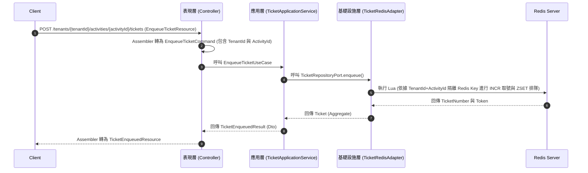
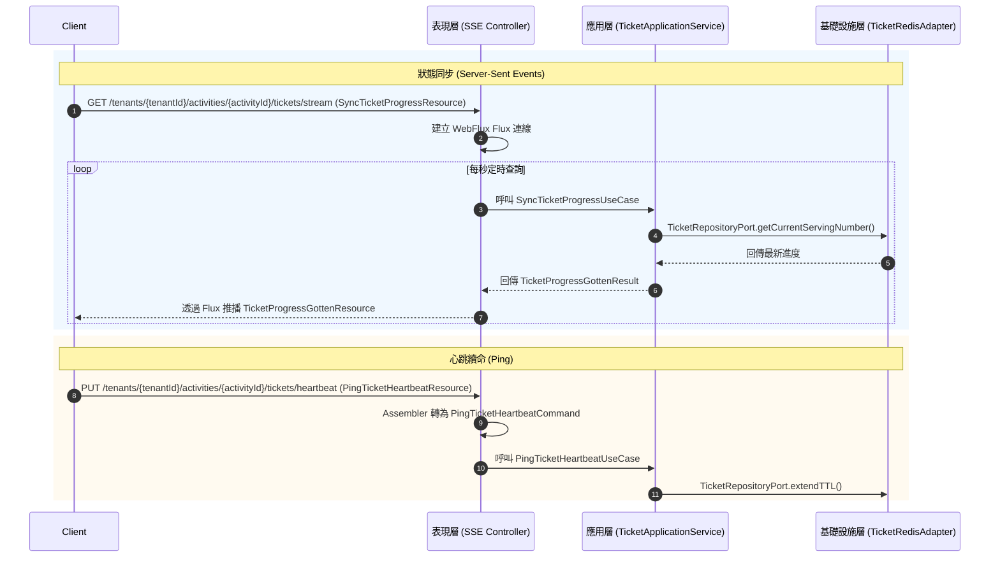
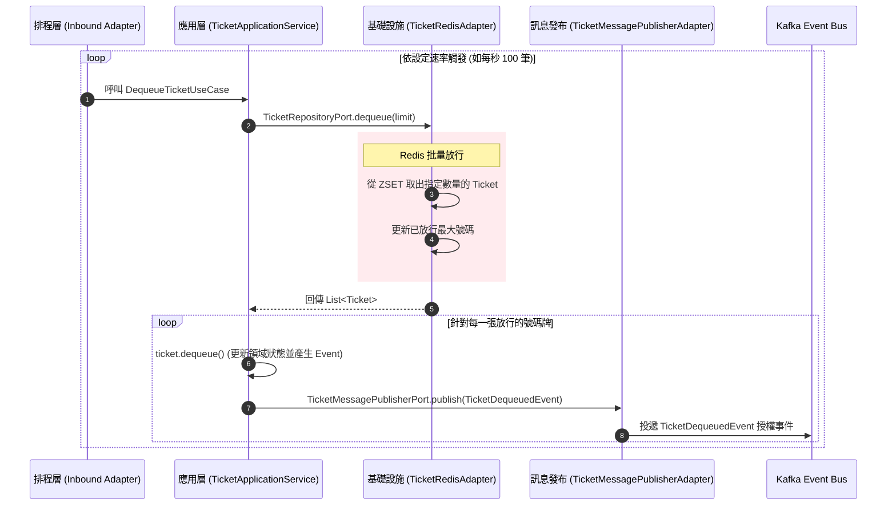

# 排隊微服務 (QMS) 核心流程設計 (DDD & 六角形架構)

本文件專注於**「排隊微服務本身」**的核心流程設計。
依照架構決策，排隊系統屬於邊界層，為了追求極致效能與極簡化，**不引入 CQRS 與 Event Sourcing**，但仍嚴格遵循工作區的 `AGENTS.md` 規範，落實 **DDD（領域驅動設計）**與**六角形架構 (Hexagonal Architecture)**。

---

## 1. 核心領域模型定義 (SaaS 多租戶架構)

為了支援 SaaS (Software as a Service) 模式，系統必須具備**多租戶 (Multi-Tenancy)** 與**多活動 (Multi-Activity)** 的隔離能力。
在排隊系統中，我們的核心 Aggregate Root 依然是 `Ticket` (號碼牌)，但其內部必須強綁定租戶與活動的上下文。
*   **Aggregate Root**: `Ticket`
*   **Value Objects (VO)**: `TenantId` (租戶識別), `ActivityId` (活動識別), `TicketId`, `TicketStatus` (QUEUING, DEQUEUED, TIMEOUT), `QueueToken`

---

## 2. 獲取號碼牌流程 (Enqueue)

使用者發起排隊請求，系統透過 Redis Lua Script 原子化發放號碼牌。

### 命名與分層約束對齊：
*   **Resource (In/Out)**: `EnqueueTicketResource`, `TicketEnqueuedResource`
*   **Command**: `EnqueueTicketCommand`
*   **UseCase (Inbound Port)**: `EnqueueTicketUseCase`
*   **Application Service**: `TicketApplicationService` (無 CQRS，統包處理)
*   **Outbound Port & Adapter**: `TicketRepositoryPort` 由 `TicketRedisAdapter` (宣告為 package-private) 實作。

---

## 3. 即時狀態同步與心跳續命 (SSE & Heartbeat)

前端透過 SSE 獲取當前叫號進度，並定時發送 Ping 維持 Token 的有效性。

---

## 4. 批次放行與事件觸發流程 (Dequeue & Publish)

排隊微服務的背景排程，根據後端量能，定時從 Redis 取出排隊名單，並發送放行事件至 Kafka。

### 邊界設計細節 (SaaS 考量)：
*   **觸發點 (Inbound Adapter)**：Spring `@Scheduled` 背景排程（或分散式排程如 XXL-JOB）針對「不同的 Tenant 與 Activity」獨立執行 `DequeueTicketUseCase`，各自控制放行速率。
*   **Redis Key 隔離**：底層 Adapter 操作 Redis 時，所有 Key 皆須帶有前綴 `qms:tenant:{tenantId}:activity:{activityId}`，確保不同客戶（租戶）的排隊活動資料絕對物理隔離。
*   **領域事件發布 (攜帶租戶資訊)**：`Ticket` Aggregate 在呼叫 `dequeue()` 行為方法時產生 `TicketDequeuedEvent` (`N + Ved + Event`)。該事件**必須包含 `TenantId` 與 `ActivityId`**，隨後交由 `TicketMessagePublisherPort` 發送至 Kafka。
*   **動態路由或 Topic 隔離**：Kafka 可依據 TenantId 發送至不同的 Topic，或共用 Topic 但以 TenantId 作為 Partition Key，讓多租戶的後端核心系統能精準識別並消費屬於自己的授權事件。
